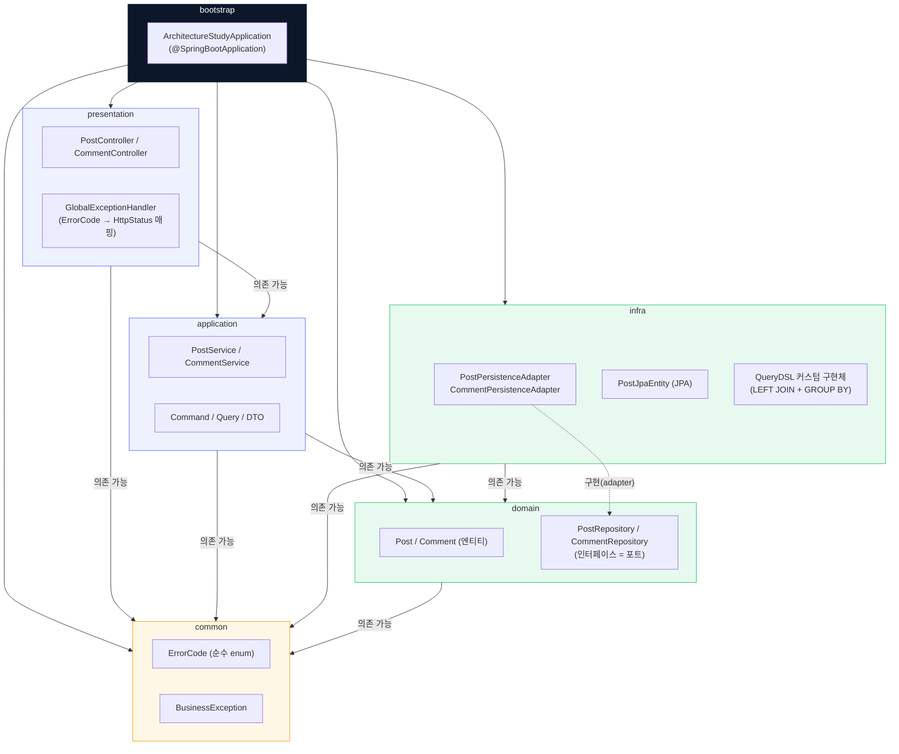

# architecture-study

본 프로젝트는 객체 지향 설계 원칙과 계층형/포트-어댑터(헥사고날) 아키텍처를 기반으로 설계된 Java 멀티 모듈 시스템입니다.<br> 
Spring Boot로 게시글/댓글 REST API를 만들고 그 위에서 실무에서 실제로 마주치는 성능·아키텍처 문제(N+1, DB 커넥션 풀 고갈, 계층 경계 침범)를 겪고 근본 원인부터 해결까지 정량적으로 검증했습니다.

## 🛠 기술 스택 (Tech Stack)

- **Language**: Java 17
- **Framework**: Spring Boot 4.1.0
- **ORM**: Spring Data JPA, QueryDSL 5.1.0
- **Database**: PostgreSQL 16
- **Dependency Management**: Gradle (Groovy DSL, 멀티모듈)
- **Test & Coverage**: JUnit 5, Mockito, AssertJ, Testcontainers, JaCoCo
- **Load Test**: Apache JMeter, k6
- **Infra**: Docker, Docker Compose
- **Monitoring**: Spring Boot Actuator, Prometheus, Grafana

## 🏗 전체 프로젝트 구조 (Project Structure)

프로젝트는 관심사 분리를 위해 다음과 같은 6개의 모듈로 구성되어 있습니다.

```
architecture-study/
├── bootstrap       # 애플리케이션 시작점 및 전체 설정 (Spring Boot)
├── presentation    # 인바운드 어댑터 (REST API, Controller, GlobalExceptionHandler)
├── application     # 비즈니스 로직 및 유즈케이스 (Service, Command/Query/DTO)
├── domain          # 핵심 비즈니스 모델 및 엔티티, 리포지토리 인터페이스(포트)
├── infra           # 아웃바운드 어댑터 (JPA/QueryDSL Persistence 구현체)
└── common          # 프레임워크 의존성 없는 순수 Java (ErrorCode, BusinessException)
```

`infra`와 `presentation`은 서로를 전혀 모르고, `domain`/`application`을 통해서만 간접적으로 연결됩니다. 이 경계는 패키지 컨벤션이 아니라 **Gradle 모듈 의존성**으로 강제되어, `build.gradle`에 `implementation project(':B')` 선언이 없으면 컴파일 자체가 실패합니다.



- **실선 화살표(A → B)**: 컴파일 타임에 강제되는 모듈 의존 관계.
- **점선 화살표**: `infra`의 어댑터가 `domain`이 정의한 포트를 실제로 구현하는 관계(런타임에 스프링이 주입).
- `common`은 다른 모든 모듈이 의존할 수 있는 가장 아래 계층이며, Spring 등 프레임워크 의존성이 전혀 없습니다.

## 🐘 Gradle 설정 및 공통 의존성 (Gradle Configuration)

루트 `build.gradle`을 통해 모든 서브 프로젝트(`subprojects`)에 공통 설정을 적용하고 버전을 관리합니다.

**1. 공통 적용 플러그인 (Shared Plugins)**
- `java`: 모든 서브 모듈에 자바 컴파일 지원
- `io.spring.dependency-management`: Spring Boot BOM 기반 의존성 버전 관리 자동화
- `jacoco`: 모듈별 테스트 커버리지 리포트 생성
- `org.springframework.boot`: 실행 가능한 jar가 필요한 `bootstrap` 모듈에만 적용

**2. 전역 공통 의존성 (Global Dependencies)**
- `spring-boot-starter-test`: JUnit 5 기반 테스트 프레임워크
- `junit-platform-launcher`

**3. 컴파일러 옵션**
멀티모듈 전환 시 Spring Boot Gradle 플러그인이 단일 모듈에서 자동으로 붙여주던 `-parameters` 옵션이 빠지는 문제가 있어(`@PathVariable`이 파라미터 이름을 못 찾음), 전 모듈에 명시적으로 추가했습니다.

**4. JaCoCo 리포트**
루트에 통합 리포트 태스크는 없고, 모듈별 `test` 태스크에 `jacocoTestReport`가 `finalizedBy`로 연동돼 있어 `./gradlew test` 실행만으로 모듈별 리포트가 함께 생성됩니다(`{module}/build/customJacocoReportDir/`).

## 🔍 다룬 핵심 문제

### N+1 문제 → QueryDSL로 해결
`GET /posts`에서 게시글마다 댓글 수를 세느라 1+N번 쿼리가 나가던 문제를 진단했습니다. 실제 병목은 "쿼리가 많아서 느림"이 아니라 **HikariCP 커넥션 풀(기본 10개) 고갈**이었고(`waiting=189` 후 30초 타임아웃 로그로 확인), QueryDSL `LEFT JOIN` + `GROUP BY` + DTO 프로젝션으로 요청당 쿼리를 1개로 줄여 해결했습니다.

### 부하테스트 기반 Saturation Point 분석
JMeter/k6로 VU 10→50→100→200→400 계단식 부하를 걸어 개선 전후를 정량 비교했습니다.

| 지표 | Before (N+1) | After (QueryDSL) |
|---|---|---|
| Saturation Point | VU 10~50 구간 | VU 100 구간 |
| 처리량(TPS) 한계 | 6.3/s | 약 38.7/s (약 6배) |
| 에러율 | 95.87% | 0% |
| 병목 원인 | DB 커넥션 풀 고갈 | CPU 포화 (1코어 제한) |

### 예외 처리 아키텍처
`ErrorCode`(순수 enum) / `BusinessException` / `GlobalExceptionHandler`로 예외 처리를 일원화했습니다. `ErrorCode`에서 Spring `HttpStatus` 의존성을 제거해, domain과 presentation의 책임을 분리했습니다.

### 테스트 커버리지 100%
Testcontainers로 실제 PostgreSQL을 띄우는 통합 테스트를 구성해, `common`/`domain`/`application`/`infra`/`presentation` 5개 모듈 전부 라인 커버리지 100%를 달성했습니다. 로컬 DB 준비 없이 `./gradlew clean build` 한 번으로 통과합니다.

## 📮 API

| Method | URL | 설명 |
|---|---|---|
| GET | `/posts` | 게시글 목록 + 댓글 수 조회 |
| GET | `/posts/{id}` | 게시글 단건 조회 |
| POST | `/posts` | 게시글 생성 |
| PUT | `/posts/{id}` | 게시글 수정 |
| DELETE | `/posts/{id}` | 게시글 삭제 |
| GET | `/posts/{postId}/comments` | 댓글 목록 조회 |
| POST | `/posts/{postId}/comments` | 댓글 생성 |
| PUT | `/posts/{postId}/comments/{commentId}` | 댓글 수정 |
| DELETE | `/posts/{postId}/comments/{commentId}` | 댓글 삭제 |

## 🚀 실행 및 테스트 (Execution & Test)

**애플리케이션 실행**
```bash
./gradlew :bootstrap:bootRun
```

**Docker Compose로 실행** (PostgreSQL 포함)
```bash
cp .env.example .env   # DB 계정 정보 채우기
docker compose up -d --build
```

**전체 테스트 실행 및 커버리지 확인**
```bash
./gradlew clean build
```
Testcontainers가 테스트 실행 시점에 Docker로 PostgreSQL을 직접 띄우고 정리하므로, 로컬 DB를 미리 준비할 필요가 없습니다.

**부하테스트**
```bash
loadtest/jmeter/run-loadtest.bat
```
`get-posts.jmx`가 VU 10→50→100→200→400 계단식 시나리오(각 단계 30초)를 실행하고, 결과 리포트를 `loadtest/jmeter/report/index.html`에 생성합니다.

**모니터링 (선택)**
```bash
docker compose up -d prometheus grafana
```
Grafana(`http://localhost:3000`, admin/admin)에서 부하테스트 중 CPU·메모리·JVM 힙을 실시간으로 확인할 수 있습니다.

---

Last updated: 2026-08-26
